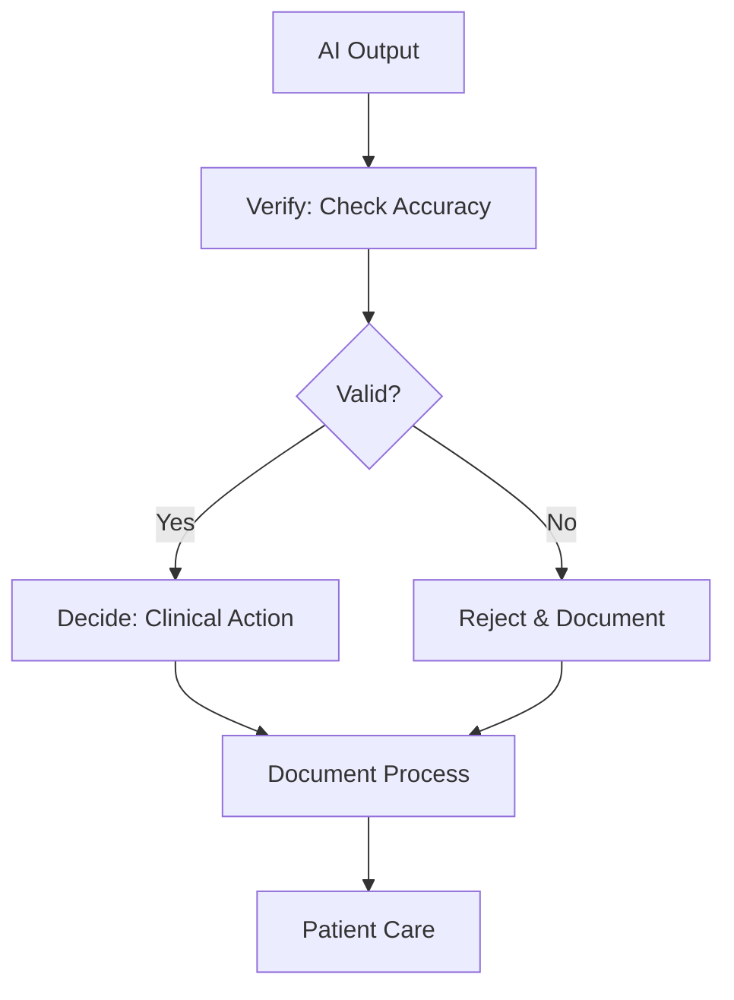

## Overview

Anesthesia SmartSite provides essential tools for anesthesiologists to integrate AI responsibly into patient care. You gain access to the VDD framework, learning resources, event updates, and defensible practice utilities. These features emphasize ethical AI use, ensuring you verify outputs, make informed decisions, and document processes for safer outcomes.

<Columns cols={3}>
  <Card title="VDD Framework" icon="shield" href="/vdd-framework">
    Verify, Decide, Document—your guide to supervised AI in anesthesiology.
  </Card>
  <Card title="Resource Guides" icon="book-open" href="/resources">
    Curated guides for practical AI applications.
  </Card>
  <Card title="AI Quizzes" icon="activity" href="/quizzes">
    Test your knowledge on AI ethics and tools.
  </Card>
  <Card title="Event Updates" icon="calendar" href="/events">
    Stay informed on conferences like UC Davis Anesthesiology Update.
  </Card>
  <Card title="Presentation Slides" icon="download" href="/presentations">
    Download slides for training and reference.
  </Card>
  <Card title="Defensible Tools" icon="check-circle" href="/tools">
    Ensure compliant, supervised AI practices.
  </Card>
</Columns>

## The VDD Framework

The VDD framework—Verify, Decide, Document—structures your AI interactions for defensible practice. You first verify AI outputs against clinical standards, then decide on actions, and finally document the process.



<Steps>
  <Step title="Verify" icon="search">
    Cross-check AI suggestions with patient data and guidelines.

````markdown
```javascript
// Example: Validate AI dosage recommendation
const aiDose = getAIDose(patientVitals);
if (aiDose > safeThreshold(patientWeight)) {
  console.log('Verify failed: Adjust manually');
}
```
````
  </Step>
  <Step title="Decide" icon="brain">
    Use your expertise to approve or modify the AI input.
  </Step>
  <Step title="Document" icon="file-text">
    Log the AI use, verification, and decision in the record.
  </Step>
  <Step title="Implement" icon="checkmark">
    Execute the verified decision in your clinical workflow.
  </Step>
</Steps>

<Callout kind="tip">
  Always supervise AI tools manually. VDD ensures compliance and patient safety.
</Callout>

## Use Cases Across Practice

<Tabs>
  <Tab title="Pre-Op Planning" icon="clipboard-list">
    Use VDD to assess AI-generated risk profiles.

    <CodeGroup tabs="JavaScript,Python">
````javascript
// Pre-op risk scoring
const riskScore = calculateRisk(patientHistory);
verifyRisk(riskScore, vddFramework);
````
````python
# Pre-op risk scoring
risk_score = calculate_risk(patient_history)
verify_risk(risk_score, vdd_framework)
````
    </CodeGroup>
  </Tab>
  <Tab title="Intra-Op Monitoring" icon="pulse">
    Monitor AI alerts for vital signs with VDD verification.
  </Tab>
  <Tab title="Post-Op Review" icon="trending-up">
    Document AI-assisted recovery predictions.
  </Tab>
  <Tab title="Documentation" icon="file-text">
    Archive case details and decision logs.
  </Tab>
</Tabs>

## Learning and Events

Access quizzes and guides to build AI literacy. Download presentation slides from events like the 36th Annual UC Davis Anesthesiology Update in Napa 2026.

<Expandable title="Advanced Resource Integration" default-open="false">
  Embed quizzes in your training portal:

````html
<iframe src="https://www.anesthesiasmartsite.com/ai/resources/beyond-the-hype-quiz.html" width="100%" height="500"></iframe>
````
</Expandable>

## Defensible Practice Best Practices

Maintain audit trails for all AI uses. Supervised tools reduce liability while enhancing efficiency.

<Columns cols={2}>
  <Card title="Next: Quickstart" icon="rocket" href="/quickstart" horizontal>
    Set up your account and try VDD today.
  </Card>
  <Card title="Events Calendar" icon="calendar" href="/events" horizontal>
    Register for upcoming anesthesiology updates.
  </Card>
</Columns>