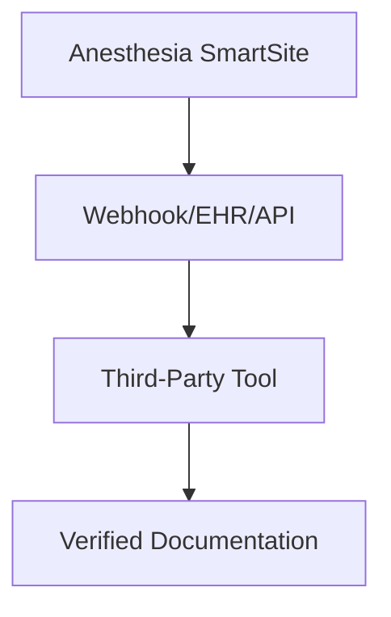

## Overview

Connect Anesthesia SmartSite to your existing tools to streamline anesthesia documentation and automate workflows. Use webhooks for real-time updates, integrate with EHR systems like Epic or Cerner, link third-party AI services, embed quizzes and resources, or build custom extensions via API. These integrations follow the VDD framework (Verify–Decide–Document) for defensible, ethical AI use in anesthesiology.

<Columns cols={3}>

<Card title="Webhooks" icon="zap" href="#webhooks">

Receive automated notifications for patient updates and documentation events.

</Card>

<Card title="EHR Systems" icon="database" href="#ehr">

Link to Epic, Cerner, and other medical databases for seamless data flow.

</Card>

<Card title="API Extensions" icon="code" href="#api">

Build custom tools with full API access.

</Card>

<Card title="AI Tools" icon="brain" href="#ai-tools">

Integrate third-party AI for advanced analysis.

</Card>

<Card title="Embeds" icon="external-link" href="#embeds">

Embed quizzes and resources in your sites.

</Card>

<Card title="Databases" icon="hard-drive" href="#databases">

Connect to medical databases for reference data.

</Card>

</Columns>

## Webhooks for Automated Updates

Set up webhooks to receive real-time events from Anesthesia SmartSite, such as new documentation entries or patient status changes. Configure your webhook endpoint to handle `POST` requests with JSON payloads.

<Steps>

<Step title="Create Webhook" icon="settings">

Navigate to your dashboard at `https://dashboard.example.com/webhooks`.

Enter your endpoint URL, like `https://your-webhook-url.com/anesthesia-updates`.

Select events: `document.created`, `patient.updated`.

</Step>

<Step title="Secure Endpoint" icon="shield">

Add `YOUR_API_KEY` as a header for authentication.

Validate payloads using HMAC signatures.

</Step>

<Step title="Test Webhook" icon="play">

Use the dashboard test button to send a sample payload.

</Step>

<Step title="Monitor Events" icon="activity">

Track webhook deliveries and responses in your dashboard logs.

</Step>

</Steps>

<Callout kind="tip">

Store `YOUR_WEBHOOK_SECRET` securely and verify signatures to prevent unauthorized access.

</Callout>

Here is a sample webhook payload:

```json
{
  "event": "document.created",
  "patientId": "pt-12345",
  "timestamp": "2024-01-15T10:30:00Z",
  "data": {
    "vddStatus": "verified"
  }
}
```

<CodeGroup tabs="Node.js,Python">

````javascript
const express = require('express');
const crypto = require('crypto');
const app = express();

app.use(express.json());

app.post('/anesthesia-updates', (req, res) => {
  const signature = req.headers['x-signature'];
  const payload = JSON.stringify(req.body);
  const expected = crypto.createHmac('sha256', `YOUR_WEBHOOK_SECRET`).update(payload).digest('hex');
  
  if (signature === `sha256=${expected}`) {
    console.log('New anesthesia document:', req.body);
    res.status(200).send('OK');
  } else {
    res.status(401).send('Unauthorized');
  }
});
````


````python
import hmac
import hashlib
from flask import Flask, request, abort

app = Flask(__name__)
SECRET = 'YOUR_WEBHOOK_SECRET'

@app.route('/anesthesia-updates', methods=['POST'])
def webhook():
    signature = request.headers.get('X-Signature')
    payload = request.data
    expected = hmac.new(
        SECRET.encode(), payload, hashlib.sha256
    ).hexdigest()
    
    if signature != f'sha256={expected}':
        abort(401)
    
    print('New anesthesia document:', request.json)
    return 'OK', 200
````

</CodeGroup>

## EHR Systems Integration

Integrate Anesthesia SmartSite with popular EHR systems using OAuth or API keys. Follow these platform-specific guides.

<Tabs>

<Tab title="Epic" icon="shield">

Obtain your Epic API credentials from the developer portal.

Use FHIR endpoints for patient data sync.

```javascript
const response = await fetch('https://fhir.epic.com/interconnect-fhir-oauth/api/FHIR/R4/Patient/pt-12345', {
  headers: { Authorization: `Bearer YOUR_EPIC_TOKEN` }
});
```

</Tab>

<Tab title="Cerner" icon="database">

Register your app in Cerner Forge.

Scope: `patient/*.read`.

```javascript
const response = await fetch('https://fhir-open.cerner.com/r4/ec2458f2-1e24-41c8-b71b-0e701af7583d/Patient', {
  headers: { Authorization: `Bearer YOUR_CERNER_TOKEN` }
});
```

</Tab>

<Tab title="Custom EHR" icon="plug">

Implement FHIR REST API compatibility for your EHR system.

Use standard authentication and data format mappings.

</Tab>

</Tabs>

<ParamField path="patientId" param-type="string" required="true">

Unique patient identifier from EHR.

</ParamField>

<ParamField header="Authorization" param-type="string" required="true">

Bearer token for auth.

</ParamField>

## Third-Party AI Tools

Enhance VDD workflows by piping data to tools like OpenAI or custom models.

<Request tabs="cURL,JavaScript">

```bash
curl -X POST https://api.example.com/v1/ai/analyze \
  -H "Authorization: Bearer YOUR_API_KEY" \
  -H "Content-Type: application/json" \
  -d '{
    "text": "Patient notes: hypotension during induction",
    "model": "gpt-4"
  }'
```

````javascript
const response = await fetch('https://api.example.com/v1/ai/analyze', {
  method: 'POST',
  headers: {
    'Authorization': 'Bearer YOUR_API_KEY',
    'Content-Type': 'application/json'
  },
  body: JSON.stringify({
    text: 'Patient notes: hypotension during induction',
    model: 'gpt-4'
  })
});
````

</Request>

<Response>

```json
{
  "decision": "Verify BP trends before proceeding",
  "confidence": 0.95
}
```

</Response>

## Embedding Quizzes and Resources

Embed interactive quizzes or resource guides directly into your intranet or EHR portals.

```html
<iframe
  src="https://www.anesthesiasmartsite.com/ai/resources/beyond-the-hype-quiz.html"
  width="100%"
  height="600"
  frameborder="0">
</iframe>
```

<Callout kind="alert">

Ensure embeds comply with HIPAA by using secure HTTPS and restricting access.

</Callout>

## Custom Database Connections

Link to medical databases for reference data during documentation.

Use SQL queries via our JDBC/ODBC drivers or REST APIs.

```sql
SELECT drug_name, dosage FROM medications WHERE condition = 'hypotension';
```

## Next Steps

<Columns cols={2}>

<Card title="API Reference" icon="book-open" href="/api-reference" horizontal>

Explore full endpoints and schemas.

</Card>

<Card title="Changelog" icon="git-branch" href="/changelog" horizontal>

Stay updated on integration improvements.

</Card>

</Columns>

